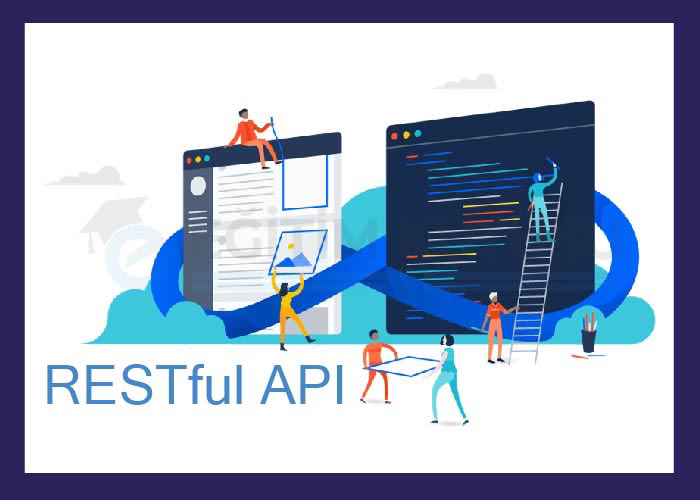

# What Is API Documentation?
Customers may become frustrated and may develop a negative opinion of you if your documentation is insufficient. Poor documentation not only detracts from the user experience, but also from the company's bottom line because these customers are less likely to keep the item or make another purchase from the company.

The same is true for API providers, cuisine blogs, and furniture retailers. Application programming interface (API) providers, or businesses who create, publish, and frequently monetize APIs, must offer API documentation that is accurate, detailed, and up-to-date. If not, it won't matter if they have the best API since if people don't know how to use it, they won't.

You probably use or create APIs, or maybe even both, as they become more common in the digital economy. Because of this, it's crucial to be able to read and write API documentation. Starting off, let's define what API documentation is.

> API Documentation : A description of how to utilise an API and its services can be found in its documentation. 

Documentation can sometimes be seen as a contract between two parties. It describes how a specific sort of request from the first party will be handled by the second party and its software. Developers can ask the API to do these types of queries, which are referred to as API calls, by following the instructions provided in the documentation.

In a style that is understandable to both novice and more experienced users, good API documentation specifies its endpoints, explains why you'd use them, and provides very precise examples of how you'd use them. Poor API documentation is overly text-based and technical, making it inaccessible to all users.

## Why API documentation matters
It's crucial to provide a top-notch API. It isn't sufficient to simply construct it and place it online, nevertheless. You must produce outstanding API documentation to go along with it if you want to benefit from an active developer community around your API.

A successful API can simplify the work of developers by allowing them to incorporate cutting-edge new technology into their applications. You can almost assure that your API users will be able to utilise it fast and easily by clearly outlining the steps involved. 

Next, we go through a few more factors that make good documentation important.
- [x] Great community engagement
- [x] Better search rankings
- [x] Fewer support requests

## How to Write API Documentation
1. Recognize the users of the API.
2. Create a user journey map.
3. Start with the basics.
4. Add samples of code.
5. List your error messages and status codes.
6. Write and create for humans.
7. Updating your documentation is a good idea.

## What are API documentation tools?
An application that you may use to create, manage, and host your API documentation is called an API documentation tool.

A variety of API documentation generators exist, some of which concentrate on producing stunning output that is easy for developers to read online. Others concentrate on creating code snippets that are machine-comprehensible in a variety of programming languages and can be used by app developers.

Which kind should you pick then? Since most solutions for API documentation are hybrids, you may definitely find one that meets your requirements.

### 4 Best API Documentation Tools
Let's look at some of your alternatives for producing documentation now that you are aware of what API Documentation tools are and the functionality they provide.

|Tool|Features|
|----|--------|
|***Backendless*** - Backendless allows you to generate API documentation for your API Services in a matter of minutes. Docs are accessible through a URL or as a downloadable file, and Backendless supports several doc types including Swagger and OpenAPI 3.0. Your API documents can be utilized to automate the client-server connection process by streamlining it with external management tools for your Backendless-managed APIs.| External service management, Multiple doc formats , No-Code app builder API integration|
|***Postman*** - Postman is a complete API development environment that allows you to manage APIs and build requests. You can share collections privately with other members of your team, add comments to requests, and use shared environments to test how changes will affect existing code without breaking it.| Environment management, Documentation & sharing , API mocking|
|***OpenAPI Generator*** - OpenAPI Generator is an Open Source code generation tool that helps you create APIs from a Swagger/OpenAPI 2.0 or 3.0 definition and automatically update them as needed so you can keep all of your documentation and code in sync at all times|Code generator, Generator templates, OpenAPI 3 support|
|***Swagger UI*** - Swagger UI is an interactive API documentation generator that renders your Swagger/OAS files in human- and machine-readable formats so your users can explore them without having to install any special software.|Mobile support , Authentication ,Templates & localization|

To make your APIs easier to use, you can publish, manage, and build them rapidly with the use of API documentation tools. There are several open source solutions that are compatible with any application or framework, even though some of them have restricted functionality.

### Examples of API Documentation
Here are some examples of well-known APIs that use different protocols and specifications. Check their documentation to get more information and references.

**Google Maps** There is no denying that Google is a tech juggernaut, and they have set the bar for how other businesses should conduct themselves. [Google Maps APIs](https://developers.google.com/maps/documentation) are used by the majority of websites with integrated maps. For instance, Google's Directions API uses an HTTP request to retrieve geolocation-specific directions in XML or JSON format.

**WeatherAPI** The weather forecast, IP lookup, sports, astronomy, geolocation, and time zone are just a few of the many diverse APIs available from this free source of meteorological and geolocation data. It offers JSON/XML RESTful API access to weather and geodata. The API can be accessed by developers via HTTP or HTTPS requests. They offer thorough [documentation](https://www.weatherapi.com/docs/) on how to use each of their APIs 
