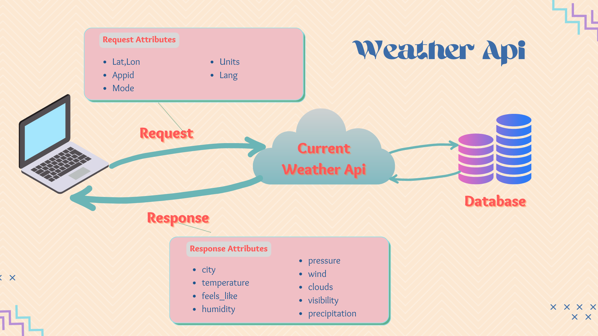

# API Documentation Example
# **What is API?** 
API stands for Application Programming Interface, and it serves as a connector between two software applications. An API is used almost exclusively in the digital world to send and retrieve data from servers.

As you might expect, APIs are crucial, yet they frequently pose difficulties for web and mobile developers. To properly use your API for their applications, these developers must comprehend how it operates.
# **What is API Documentation?**
API documentation provides developers and other users with all of the information they need to operate with the API properly. It can appear in a variety of formats, including how-to instructions, tutorials, and reference materials. Along with a range of information types, it also provides functionality, how-to manuals, and API usage samples.

The public is typically given access to API documentation so that anyone who needs it can get it. This benefits not just the developers using your API already, but also the developers determining whether your API is appropriate for their needs.
# **What is the Importance of API Documentation?**
The quality of your API documentation could mean the difference between a successful API deployment and one that fails miserably. Although developers are skilled problem solvers, it is unrealistic to expect them to automatically grasp every novel technical solution that is put in front of them. Only when your API is used by the intended audience and presented to them will it be considered valuable. Your API is only valuable to the extent that the target audience can use it.

Developers may decide not to use your API at all or they may grow dissatisfied with the implementation process if there is inadequate API documentation. The success of your API over the long run isn't really consistent with either of these situations.
# **API Documentation Example**

OpenWeather offers hyperlocal minute forecasts, historical information, the current location, as well as short-term, long-term, and forecasted weather data for every location on the planet. All information is accessible through industry-standard APIs. 
## **Current weather data API** 
With the help of OpenWeather's Current weather data API (Current weather data API), you may obtain current weather information for more than 200,000 places worldwide! They gather and analyse weather data from a variety of sources, including satellites, radars, local and worldwide weather models, and an extensive network of weather stations. The formats of the data are JSON, XML, or HTML.

### **Call current weather data**
**API call**

> https://api.openweathermap.org/data/2.5/weather?lat={lat}&lon={lon}&appid=[{API key}](https://home.openweathermap.org/api_keys)

|**Element**|**Required/Optional**|**Description**|
| :- | :- | :- |
|lat, lon|required|Geographical coordinates (latitude, longitude). If you need the geocoder to automatic convert city names and zip-codes to geo coordinates and the other way around, please use [Geocoding API](https://openweathermap.org/api/geocoding-api).|
|appid|required|Your unique API key (you can always find it on your account page under the ["API key" tab](https://home.openweathermap.org/api_keys))|
|mode|optional|Response format. Possible values are xml and html. If you don't use the mode parameter format is JSON by default.|
|units|optional|Units of measurement. standard, metric and imperial units are available.|
|lang|optional|You can use this parameter to get the output in your language|

**Examples of API calls**

> https://api.openweathermap.org/data/2.5/weather?lat=54.34&lon=70.99&appid=[{API key}](https://home.openweathermap.org/api_keys)
###
### **Weather fields in API response**

> If some of the parameters are missing from your API response, it simply implies that these meteorological events were not present at the time of measurement for the city or location you selected. In an API response, only accurate measurements or calculations are shown.
### XML
Example of API response

`    `<**current**>

`    `<**city** id="3163858" name="Zocca">

`    `<**coord** lon="10.99" lat="44.34"/>

`    `<**country**>IT</**country**>

`    `<**timezone**>7200</**timezone**>

`    `<**sun** rise="2022-08-30T04:36:27" set="2022-08-30T17:57:28"/>

`    `</**city**>

`    `<**temperature** value="298.48" min="297.56" max="300.05" unit="kelvin"/>

`    `<**feels\_like** value="298.74" unit="kelvin"/>

`    `<**humidity** value="64" unit="%"/>

`    `<**pressure** value="1015" unit="hPa"/>

`    `<**wind**>

`    `<**speed** value="0.62" unit="m/s" name="Calm"/>

`    `<**gusts** value="1.18"/>

`    `<**direction** value="349" code="N" name="North"/>

`    `</**wind**>

`    `<**clouds** value="100" name="overcast clouds"/>

`    `<**visibility** value="10000"/>

`    `<**precipitation** value="3.37" mode="rain" unit="1h"/>

`    `<**weather** number="501" value="moderate rain" icon="10d"/>

`    `<**lastupdate** value="2022-08-30T14:45:57"/>

`    `</**current**>

##### **Parameters:**

|**Element**|**Description**|**Type**|
| :- | :- | :- |
|
city

|A list of attributes related to the city you selected based on lat and long in the request.|City data object|
|city.id  |The City ID for the city that is selected. |String|
|city.name |The City name for the city that is selected.|String|
|
city.coord 

|A list of attributes related to the geographic location of the city.|City coord |
|city.coord.lon |Longitude of the city’s geographic location|String|
|city.coord.lat |Latitude of the city’s geographic location|String|
|city.country |The Country code (GB, JP etc.) Of the city that is selected|String|
|timezone|The timezone shift in seconds from UTC|String|
|city.sun|A list of attributes related to sun time at the city|City sun |
|
city.sun.rise 

|Sunrise time of the city that is selected on the selected day|String|
|city.sun.set |Sunset time of the city that is selected on the selected day|String|
|
temperature

|A list of temperature attributes|Temperature data object|
|temperature.value |Temperature of the city at the moment of calculation|String|
|temperature.min  |Minimum temperature at the moment of calculation. This is minimal currently observed temperature (within large megalopolises and urban areas), use this parameter optionally.|String|
|temperature.max  |Maximum temperature at the moment of calculation. This is maximal currently observed temperature (within large megalopolises and urban areas), use this parameter optionally.|String|
|
temperature.unit 

|Unit of measurements. Possible value is Celsius, Kelvin, and Fahrenheit.|String|
|
feels\_like

feels\_like.value 
|Temperature. This temperature parameter accounts for the human perception of weather.|Feels like data object|
|
feels\_like.unit 

|Unit of measurements. Possible value is Celsius, Kelvin, and Fahrenheit. Default unit is: Kelvin|String|
|
humidity

|A list of Humidity attributes|Humidity data object|
|
humidity.value 

|Humidity value in the city at the time of calculation|String|
|
humidity.unit 

|Humidity units, %|String|
|
pressure

|A list of Pressure attributes|Pressure data object|
|
pressure.value 

|Pressure value in the city at the time of calculation|String|
|
pressure.unit

|` `Pressure units, hpa|String|
|
wind

|A list of wind attributes|Wind data object|
|
wind.speed

|A list of wind speed attributes|Wind speed |
|wind.speed.value |Wind speed in the city at the time of calculation|String|
|wind.speed.unit  |
Wind speed units, m/s

|String|
|
wind.speed.name 

|Type of the wind that is observed|String|
|
wind.direction

|A list of wind direction attributes|Wind direction data object|
|
wind.direction.value 

|Wind direction value, Default unit is - degrees (meteorological)|String|
|
wind.direction.code 

|Code of the wind direction. Possible value is WSW, N, S etc.|String|
|
wind.direction.name 

|Full name of the wind direction.|String|
|
clouds

|A list of cloud attributes|Cloud data object|
|
clouds.value 

|Cloudiness that is observed at the moment|String|
|
clouds.name 

|Name of the cloudiness that is observed at the moment|String|
|
visibility

|A list of visibility attributes|Visibility data object|
|
visibility.value 

|Visibility, Default unit is meter. The maximum value of the visibility is 10km|String|
|precipitation|A list of precipitation attributes|Precipitation data object|
|
precipitation.value 

|Precipitation that is observed at the moment, Default unit is mm|String|
|
precipitation.mode 

|Possible values are ‘No’ or name of weather phenomena such as 'rain', 'snow'|String|
|
weather

|A list of weather attributes|Weather data object|
|
weather.number 

|Weather condition id for the weather at the moment.|String|
|
weather.value 

|Name of the weather that is observed.|String|
|
weather.icon 

|Weather icon id|String|
|
lastupdate

|A list of last update attributes|Last update data object|
|
lastupdate.value 

|Last time when data was updated|String|

# **Reference**
*Current weather data API*. (n.d.). Retrieved from Openweathermap: https://openweathermap.org/current#list
